# NovaTIP

**NovaTIP** — локальная Threat Intelligence Platform: каталог уязвимостей (NVD + KEV + БДУ ФСТЭК + внутренние ID), заявки на устранение, лицензирование и мастер первой настройки.

Меню консоли: **Дашборд · Уязвимости · Заявки · Настройки**.  
Модуль **Wiki / NovaWIKI в продукте отсутствует** (вне скоупа).

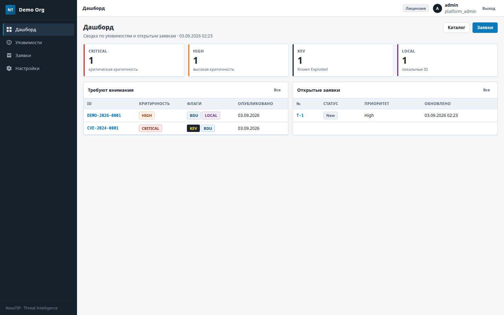

## Быстрый старт (Docker Compose)

```bash
cp .env.example .env
docker compose up --build -d
```

Откройте [http://127.0.0.1:8000/](http://127.0.0.1:8000/) и пройдите мастер `/setup/`.

Переменные окружения описаны в [`.env.example`](.env.example). Не коммитьте реальный `.env`.

Подробнее: [docs/DOCKER_DEV.md](docs/DOCKER_DEV.md).

## Документация (РЕД ОС 8 «с нуля»)

| Файл | Содержание |
|---|---|
| [docs/00_OVERVIEW.md](docs/00_OVERVIEW.md) | Обзор архитектуры |
| [docs/01_VM_AND_OS.md](docs/01_VM_AND_OS.md) | ВМ и установка РЕД ОС 8 |
| [docs/02_STACK_INSTALL.md](docs/02_STACK_INSTALL.md) | PostgreSQL, Redis, Python, Nginx, firewall, SELinux |
| [docs/03_APP_INSTALL.md](docs/03_APP_INSTALL.md) | `/opt/novatip`, venv, systemd, TLS |
| [docs/04_WIZARD_AND_FIRST_LOGIN.md](docs/04_WIZARD_AND_FIRST_LOGIN.md) | Мастер, режимы БД, первый вход |
| [docs/05_OPERATIONS.md](docs/05_OPERATIONS.md) | Бэкап, обновление, логи |
| [docs/DEPLOY_REDOS8.md](docs/DEPLOY_REDOS8.md) | Сводный чеклист |
| [docs/DOCKER_DEV.md](docs/DOCKER_DEV.md) | Dev через Compose |

## UI

- Django-шаблоны: `templates/`
- Стили/JS (без CDN): `static/css/tip-console.css`, `static/js/tip-ui.js`, `static/js/htmx-lite.js`
- HTML-прототипы: `design/novatip-ui/`

Дизайн: тёмный сайдбар `#15202b`, акцент `#0a7ab8`, холст `#f4f6f8` — enterprise-консоль, не «фиолетовый SaaS».

## Скриншоты

### Мастер настройки

| Лицензия | Организация | Создание БД |
|---|---|---|
| 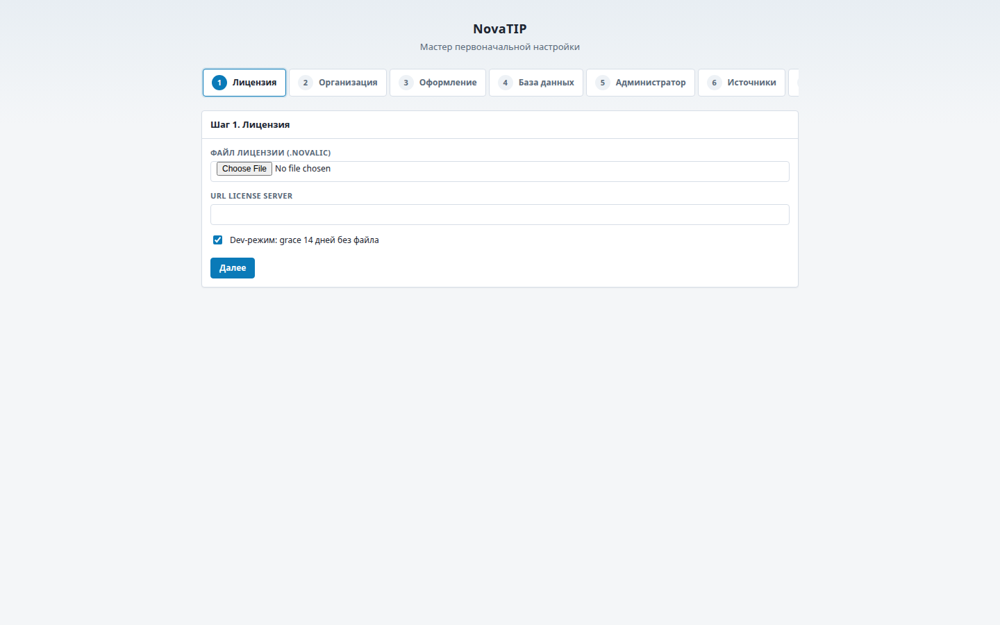 | 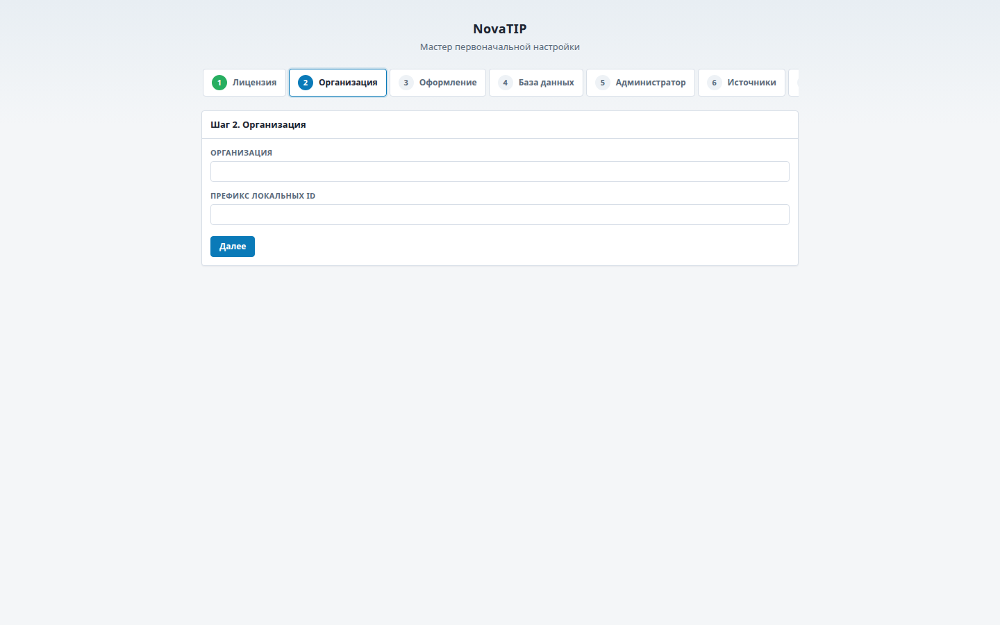 | 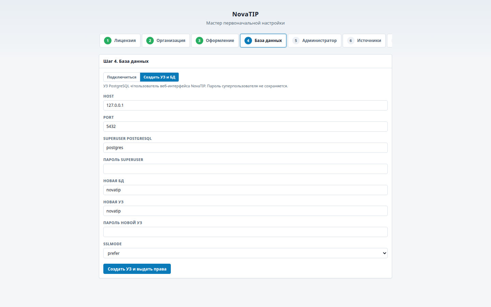 |

### Вход и дашборд

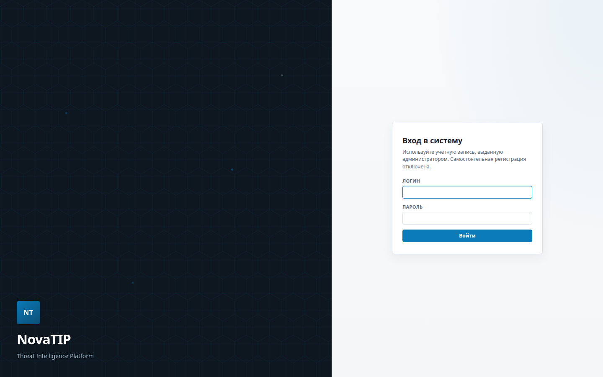


### Уязвимости

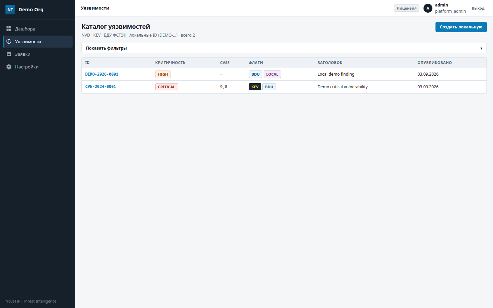

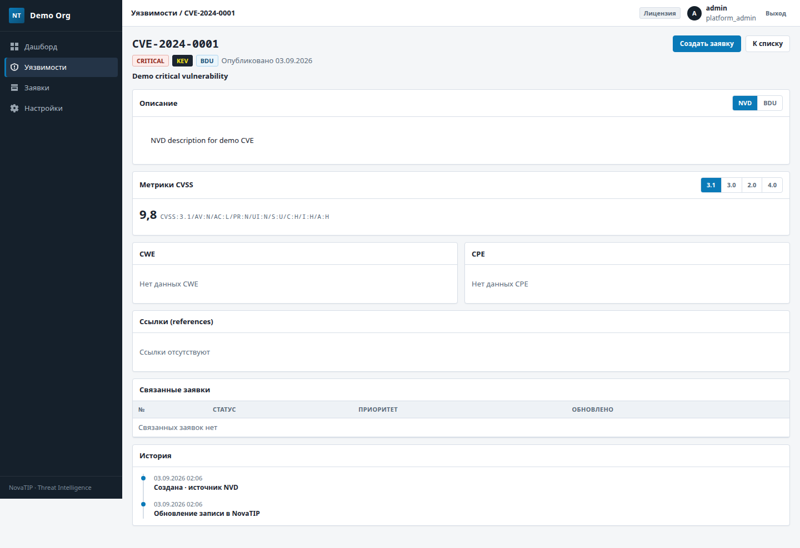

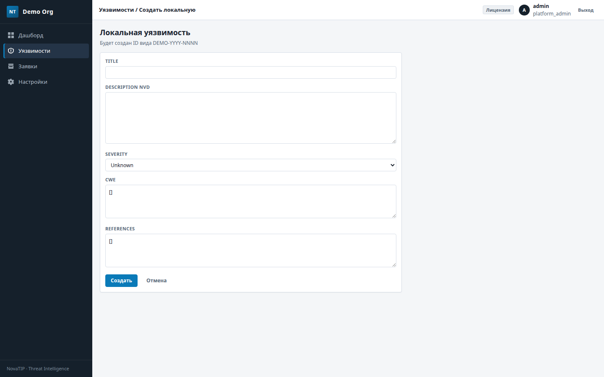

### Заявки

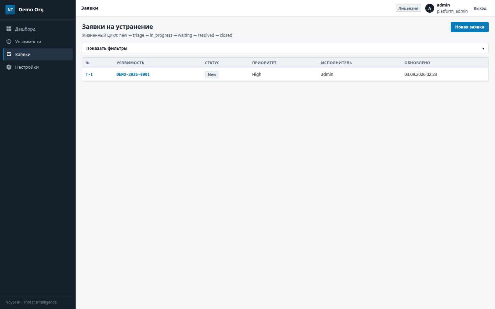

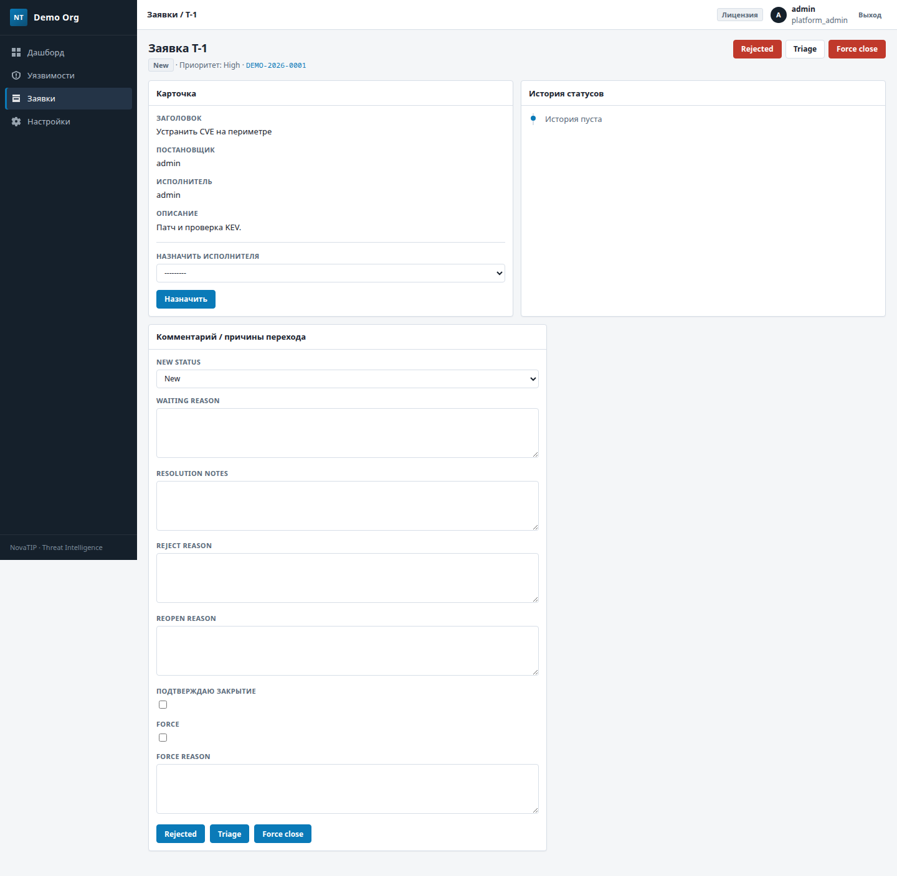

### Настройки и лицензия

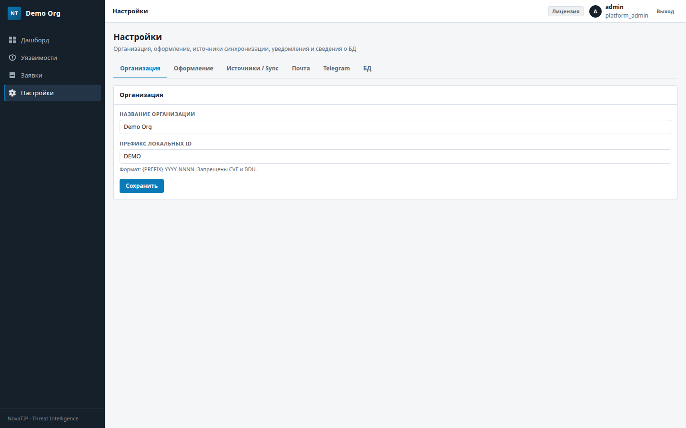

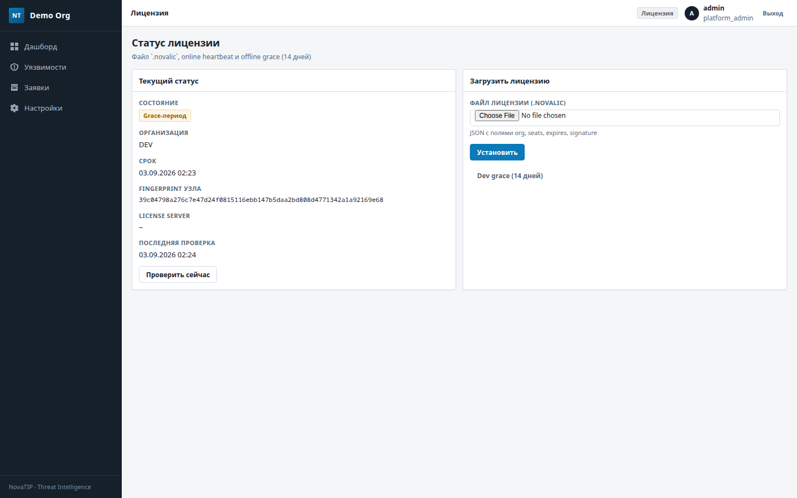

Все файлы: [`docs/screenshots/`](docs/screenshots/).

## Стек

Django 5 · PostgreSQL 16 · Redis 7 · Celery · Gunicorn · Nginx (прод на РЕД ОС 8).

## Лицензия агентного промпта сборки

Исторический полный промпт сборки (если нужен агенту) вынесен в [`prompts/BUILD_PROMPT.md`](prompts/BUILD_PROMPT.md). Этот README — продуктовый.
